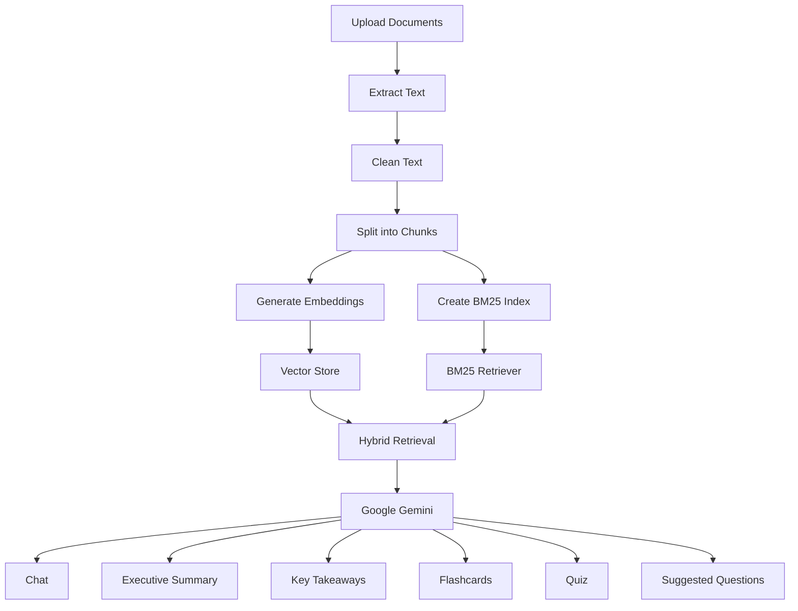
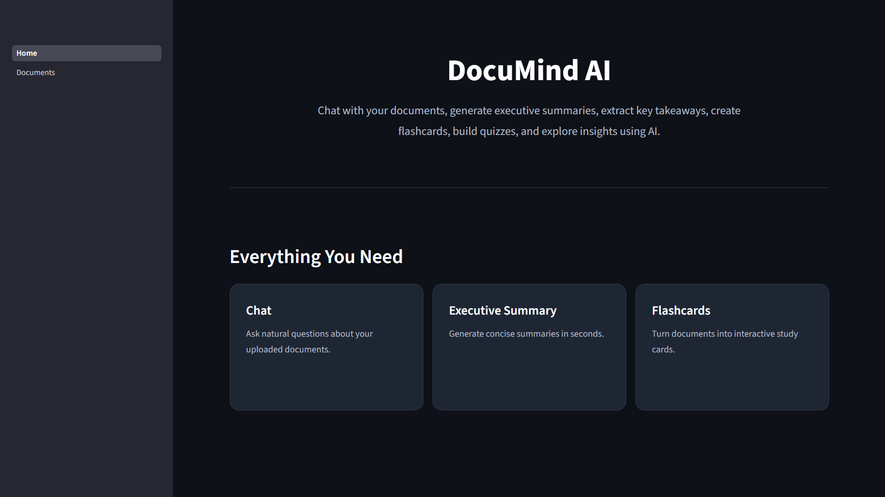
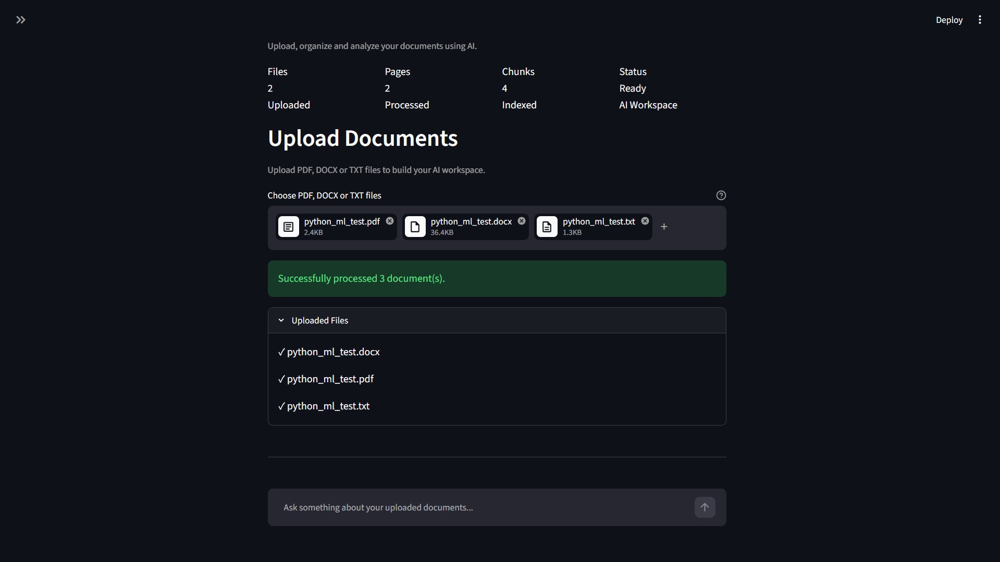
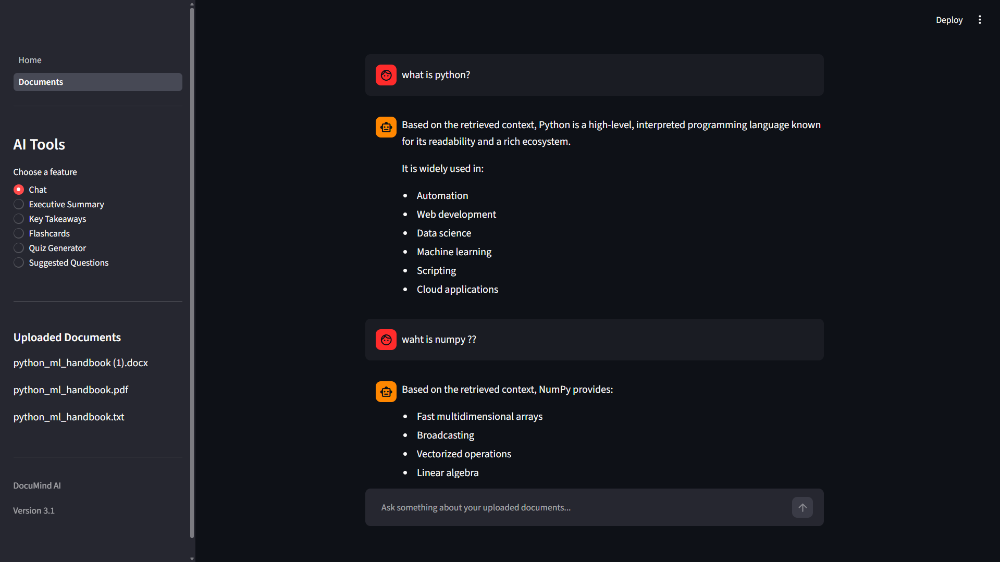
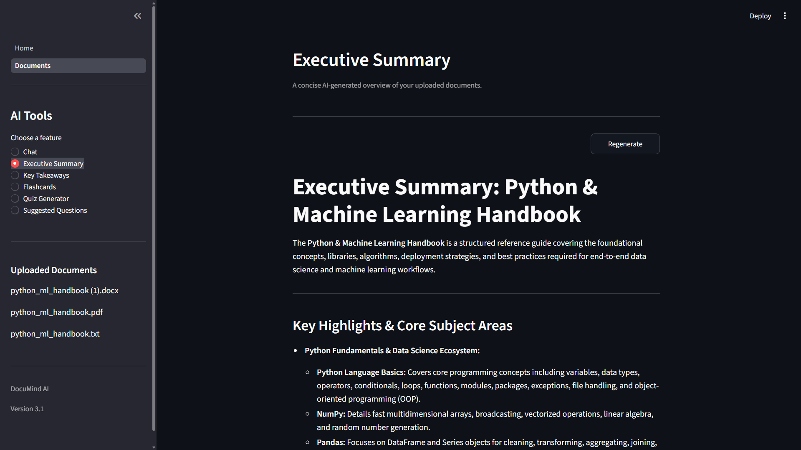
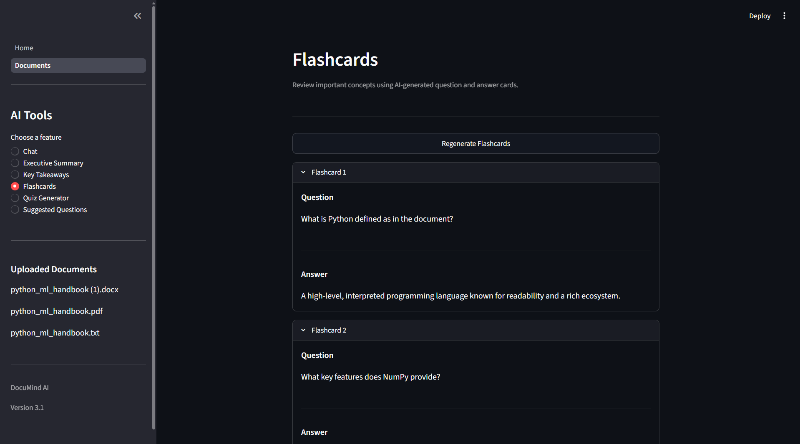
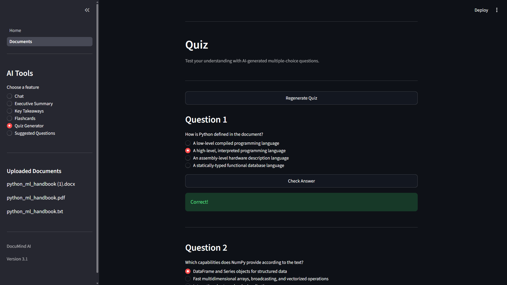

# DocuMind AI
> **An AI-powered document intelligence platform that transforms documents into interactive knowledge using Retrieval-Augmented Generation (RAG).**

DocuMind AI enables users to upload PDF, DOCX, and TXT documents and interact with them through natural language. It combines semantic vector search with BM25 keyword retrieval to provide accurate, context-aware responses using Google's Gemini model.

---

## Features

- Chat with uploaded documents using AI
- Generate executive summaries
- Extract key takeaways
- Create AI-powered flashcards
- Generate multiple-choice quizzes
- Suggest meaningful follow-up questions
- Hybrid Retrieval (Vector Search + BM25)
- Support for PDF, DOCX, and TXT documents
- Clean, modular Streamlit interface

---

## Architecture



---

## Tech Stack

### Frontend

- Streamlit

### AI

- Google Gemini

### Retrieval

- Sentence Transformers
- FAISS
- BM25

### Backend

- Python

### Document Processing

- PyMuPDF
- python-docx

### Utilities

- NumPy
- Pandas

---

## Project Structure

```text
DocuMindAI/

├── assets/
│   └── css/

├── components/
│   ├── ai_tools.py
│   ├── chat.py
│   ├── flashcards.py
│   ├── key_points.py
│   ├── quiz.py
│   ├── sidebar.py
│   ├── suggested_questions.py
│   ├── summary.py
│   ├── uploader.py
│   └── workspace.py

├── pages/
│   └── 1_Documents.py

├── utils/
│   ├── ai_service.py
│   ├── bm25_store.py
│   ├── embeddings.py
│   ├── file_reader.py
│   ├── flashcards.py
│   ├── key_points.py
│   ├── quiz.py
│   ├── rank_fusion.py
│   ├── reranker.py
│   ├── retriever.py
│   ├── session.py
│   ├── suggested_questions.py
│   ├── summary.py
│   ├── text_cleaner.py
│   ├── text_splitter.py
│   ├── ui.py
│   └── vector_store.py

├── Home.py
├── config.py
├── requirements.txt
└── README.md
```

---

## Installation

Clone the repository

```bash
git clone https://github.com/yourusername/DocuMindAI.git
```

Move into the project

```bash
cd DocuMindAI
```

Create a virtual environment

```bash
python -m venv venv
```

Activate it

Windows

```bash
venv\Scripts\activate
```

Install dependencies

```bash
pip install -r requirements.txt
```

Run the application

```bash
streamlit run Home.py
```

---

## Screenshots

> Add screenshots after deployment.

### Home



### Upload



### Chat



### Executive Summary



### Flashcards



### Quiz



---

## Future Improvements

- OCR support for scanned PDFs
- Conversation memory
- Citation highlighting
- Multi-language document support
- Authentication
- Cloud storage integration
- Export summaries to PDF
- Document comparison

---

## Author

**Dhruvish Chudasama**

MCA Student | AI & Machine Learning Enthusiast
